# Architecture Overview

This document provides a comprehensive view of go-sender's architecture, component relationships, and design patterns.

> **Quick Start**: For hands-on usage, see [Getting Started](./getting-started.md). For specific concepts, see [Core Concepts](./concepts.md).

## System Architecture

### High-Level Components


## Message Processing Pipeline

### 1. Message Flow

```mermaid
flowchart LR
    subgraph "Message Creation"
        Builder[Builder API<br/>Type Safety]
    end
    
    subgraph "Routing"
        Router[Auto-Route<br/>by Type]
    end
    
    subgraph "Provider Selection" 
        Strategy[Account Strategy<br/>• Round-Robin<br/>• Health-Based<br/>• Weighted]
    end
    
    subgraph "Middleware Pipeline"
        RateLimit[Rate Limit]
        Retry[Retry Policy]
        Circuit[Circuit Breaker]
    end
    
    subgraph "API Integration"
        Transform[HTTP Transform<br/>• Auth<br/>• Headers]
        Call[API Call]
    end
    
    subgraph "Response"
        Result[Result Mapping<br/>Error Handling]
    end
    
    Builder --> Router
    Router --> Strategy
    Strategy --> RateLimit
    RateLimit --> Retry
    Retry --> Circuit
    Circuit --> Transform
    Transform --> Call
    Call --> Result
```



### 2. Component Interaction

| **Component** | **Responsibility** | **Interactions** |
|---------------|-------------------|------------------|
| **Message** | Data + Routing | `ProviderType()` → Router |
| **Sender** | Orchestration | Router → Provider Selection → Middleware |
| **Provider** | Channel-specific logic | Account Management → HTTP Transform → API |
| **Middleware** | Cross-cutting concerns | Rate Limit → Retry → Circuit Breaker → Metrics |

## Provider System Architecture

### Provider Categories

| **Category** | **Examples** | **Protocol** | **Key Features** |
|-------------|--------------|--------------|------------------|
| **SMS** | Aliyun, Tencent, Huawei | HTTP REST | Templates, signatures, regions |
| **Email** | SMTP, EmailJS, Resend | SMTP/HTTP | Attachments, HTML, scheduling |
| **IM/Bot** | WeChat, Telegram, Lark | HTTP Webhooks | Rich media, interactive elements |
| **Webhook** | Generic HTTP, Custom | HTTP | Universal integration |

### Provider Implementation Pattern

```go
// Provider Interface
type Provider interface {
    Send(ctx context.Context, msg Message, opts *SendOptions) (*SendResult, error)
    Name() string
}

// HTTP Provider Implementation
type HTTPProvider[T Account] struct {
    transformer HTTPRequestTransformer[T]
    config     BaseConfig[T]
    client     *http.Client
}

// Account Management
type BaseConfig[T Account] struct {
    Items    []T                    // Multiple accounts
    Strategy SelectionStrategy      // Account selection
    Meta     ProviderMeta          // Global settings
}
```

## Middleware Architecture

### Middleware Pipeline


### Middleware Components

| **Middleware** | **Purpose** | **Configuration** | **Failure Behavior** |
|----------------|-------------|-------------------|----------------------|
| **Rate Limiter** | Prevent API abuse | QPS, burst size | Block/delay requests |
| **Circuit Breaker** | Stop cascading failures | Failure threshold, timeout | Fail fast |
| **Retry Policy** | Handle transient errors | Max attempts, backoff | Exponential delay |
| **Queue** | Async processing | Buffer size, workers | Store for later |
| **Metrics** | Observability | Collectors, exporters | Log/export data |

## Account Management

### Multi-Account Strategy

```go
// Account Selection Strategies
type SelectionStrategy interface {
    Select(accounts []Selectable) Selectable
    Name() StrategyType
}

// Built-in Strategies
- RoundRobin:    Distribute evenly across accounts
- Random:        Random selection  
- Weighted:      Based on account weights
- HealthBased:   Prefer healthy accounts
```

### Account Health Management

```mermaid
flowchart TD
    subgraph "Health Monitoring"
        Monitor[Health Check<br/>• API Response<br/>• Latency Check<br/>• Error Rate]
    end
    
    subgraph "Strategy Selection"
        RoundRobin[Round-Robin<br/>Equal Distribution]
        HealthBased[Health-Based<br/>Prefer Healthy]
        Weighted[Weighted<br/>Based on Config]
    end
    
    subgraph "Execution & Feedback"
        Execute[Provider Execution]
        Result[Success/Failure]
        Update[Update Health<br/>Metrics Update]
    end
    
    Monitor --> RoundRobin
    Monitor --> HealthBased  
    Monitor --> Weighted
    
    RoundRobin --> Execute
    HealthBased --> Execute
    Weighted --> Execute
    
    Execute --> Result
    Result --> Update
    Update --> Monitor
```



## Integration Patterns

### SDK Integration (Programmatic)

```go
// Pattern 1: Direct Provider (Simple)
provider, _ := sms.NewProvider(accounts)
result, _ := provider.Send(ctx, message, nil)

// Pattern 2: Sender Orchestration (Production)
sender := gosender.NewSender()
sender.RegisterProvider(providerType, provider, middleware)
result, _ := sender.SendWithResult(ctx, message)
```

### CLI Integration (Operational)

```yaml
# Configuration-driven approach
accounts:
  - provider: sms
    subtype: aliyun
    name: primary
    api_key: "key"
    api_secret: "secret"
    
# Command usage
gosender send --provider sms --to "phone" --content "message"
```

## Extensibility Points

### 1. Custom Providers

```go
// Implement Provider interface
type CustomProvider struct{}

func (p *CustomProvider) Send(ctx context.Context, msg core.Message, opts *core.SendOptions) (*core.SendResult, error) {
    // Custom implementation
}
```

### 2. Custom Middleware

```go
// Implement middleware interfaces
type CustomMiddleware struct{}

func (m *CustomMiddleware) Process(ctx context.Context, req *Request) (*Response, error) {
    // Custom logic
}
```

### 3. HTTP Transformers

```go
// Custom request transformation
type CustomTransformer struct{}

func (t *CustomTransformer) Transform(ctx context.Context, msg Message, account Account) (*HTTPRequestSpec, error) {
    // Custom HTTP request building
}
```

## Performance Characteristics

### Scalability Factors

| **Component** | **Scaling Behavior** | **Bottlenecks** | **Mitigation** |
|---------------|---------------------|-----------------|----------------|
| **Sender** | Stateless, horizontal | Provider limits | Multiple accounts |
| **Provider** | Per-API limits | Rate limits | Rate limiter middleware |
| **Middleware** | Memory/CPU bound | Queue size | Async processing |
| **HTTP Client** | Connection pooling | Connection limits | Custom client config |

### Resource Usage

- **Memory**: O(accounts + middleware_state)
- **CPU**: O(message_volume × middleware_chain_length)  
- **Network**: Dependent on provider APIs
- **Goroutines**: Minimal (stateless design)

---

## Related Documentation

| **Topic** | **Document** |
|-----------|--------------|
| 🚀 **Getting Started** | [getting-started.md](./getting-started.md) |
| 💡 **Core Concepts** | [concepts.md](./concepts.md) |
| 🔌 **Provider Details** | [providers.md](./providers.md) |
| 🚦 **Middleware Guide** | [middleware.md](./middleware.md) |
| 🛠 **Advanced Usage** | [advanced.md](./advanced.md) |
